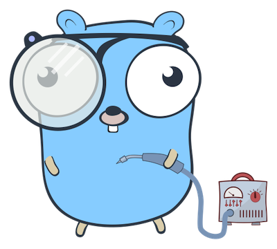
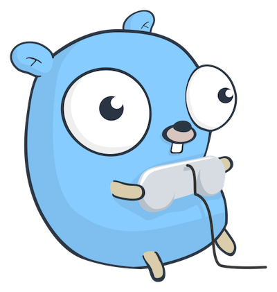

# 1: Welcome to the Machine



Welcome to your first day as Vice-President of Virtual Processors! You will find a key to the executive washroom on your desk, and free candy and snacks are available in the cafeteria. Please note there is no smoking anywhere in the building.

Your first job is to begin the design of a new virtual CPU, called the _G-machine_. Don't worry, we'll be tackling this project in easy stages. Let's first set out what exactly is required.

You will be developing a Go package which implements the G-machine. Users should be able to import your package and use it to write programs which run on the G-machine. We will develop a minimum viable product first, and gradually add more features as we go.

We will be using a simplified model of a computer system in which there are three main components:

* A _CPU_ (Central Processing Unit) which executes instructions in sequence and has _registers_ which store data while it's being processed
* A _memory_ space where the CPU can move data to or from its registers
* A _BIOS_ (Basic Input/Output System) which provides communications facilities like reading or writing to a terminal

At any given moment, the G-machine has a certain _state_: the contents of its registers, plus the contents of its memory.

The first thing users need to be able to do is to create a new G-machine they can use. So you'll be implementing a `gmachine.New()` function that returns a G-machine in its default initial state, which is specified by a test.

The test is already written for you, in the file [gmachine_test.go](gmachine_test.go), so let's get started!

**TASK:** Write the minimum code to make the test pass. Use the [gmachine.go](gmachine.go) file which has been started for you.

You'll need to define a few things first just to get the test to even compile. Once you've done that, see if you can add the minimum extra code necessary to make it pass.

When the test passes, go on to the next section.

# 2: Halt and Catch Fire


Hey, just FYI, we ran your draft G-machine design past the executive steering committee, and they loved it! Of course it's early days, but I'm sure this is going to be our next killer product. Let's start filling in some of the details.

## The fetch-execute cycle
The next feature we'll need in our virtual CPU is what's called the _fetch-execute cycle_. Essentially all computers work this way:

1. Fetch the next instruction from memory
2. Execute it.
3. Go to step 1.

## The program counter

Saying 'the _next_ instruction' implies that we have some way of remembering where we currently 'are' in memory. That is to say, we need a _register_ on the G-machine which holds the memory address of the next instruction to execute. This is what the P register is for ('P' stands for 'Program Counter', which is the traditional name for this register).

## Instructions

We also need some concept of what an 'instruction' is. You probably know that _machine language_ is the name we give to the set of instructions which a given CPU can understand. For example, the x86_64 processor understands x86_64 machine language. This is the CPU's 'native' language, if you like. If you write a program in machine language, you can run it directly on the processor. Programs in other languages need to be translated (_compiled_) into the right machine language for the CPU you want to run them on.

## Opcodes

Each instruction is represented by a numeric code, called an _opcode_, where each number 0, 1, 2... represents a distinct instruction. A program for the G-machine consists of a sequence of opcodes, perhaps with some accompanying data.

We can imagine a variety of useful instructions which the G-machine might implement: for example, if we want to do arithmetic, we might need something like an ADD instruction.

## The HALT instruction

For now, let's keep it simple, and implement a single instruction named `HALT`, which does nothing except stop the machine. It's entirely up to us which numeric values to assign to opcodes, and it makes no difference to the machine, but for simplicity let's assign `HALT` the opcode 0.

## The `Run()` method

We'll need a way for users to start the machine running, which is to say performing the fetch-execute cycle, until it's either told to stop, or runs into some kind of error. So let's provide a method on the `Machine` object named `Run()` to do this.

What would happen if we were to call the `Run()` method to start a new machine running, given that its memory and registers contain all zeroes? Well, let's follow the fetch-execute cycle:

1. Fetch the next instruction from memory. That is to say, look at the P register to see what memory address it contains, and read the instruction at that address.
2. Since the P register contains zero, we read the instruction at address zero, which is zero.
3. We increment the P register so that it points to the next memory address to read from (in this case, 1).
4. Execute the current instruction, whose opcode is zero. This is the opcode for the `HALT` instruction, so instead of jumping back to step 1, the `Run()` method should return instead.

So the upshot of all this is that if you call `Run()` on a new machine, it should return almost immediately (because it read and executed the `HALT` instruction), and the state of the machine should be unchanged except that the P register now contains the value `1`.

Let's find out!

**TASK:** Write a test function `TestHALT` which does the following:

1. Creates a new G-machine.
2. Calls `Run()` on the machine.
3. Tests that the machine's `P` register contains the value `1`. If not, the test should fail with a message like `"want P == 1, got ..."`

This test will not compile yet, of course, because we haven't written the `Run()` method. If it fails to compile for any other reason, keep working on it until it fails to compile because of the missing `Run()` method.

**TASK:** Write the _minimum_ code necessary to make the test pass. (I'm serious about this. For example, even though we talked about a fetch-execute _cycle_, you won't need to implement a loop inside the `Run()` method, because the test doesn't require it to loop. All it needs to do is increment the P register and return.)

When you have the tests passing, go on to the next section.

# 3: Busy Doing Nothing



Great job on implementing the `HALT` instruction! We now have a _programmable_ computer system, even though the programs we can write are rather simple. This is the minimal valid G-machine program:

```
HALT
```

In fact, that's also the _maximal_ program right now, since while we can write longer programs by repeating the `HALT` instruction, the extra instructions have no effect.

We ran your prototype by the Marketing group, and the feedback was generally positive, but they asked if you couldn't add at least one more instruction, so that we can write and sell useful software for the machine.

## The NOOP instruction

The next instruction to implement will be `NOOP`, short for "NO OPeration", which does nothing. This might sound a bit similar to the `HALT` instruction, which does nothing and halts, but there _is_ a difference: the `NOOP` instruction doesn't halt! Let's assign it opcode 1.

So let's do another thought experiment. What happens if we write the opcode for the `NOOP` instruction into memory address zero, and start the machine? (Think about it before you read on.)

Well, we know P starts at zero, so the first thing the machine will do is read the instruction at address zero, which is `NOOP`. Since this has no effect, the fetch-execute cycle will continue, and the machine will fetch the instruction at address 1, which is `HALT`. And the machine should stop, with the program counter P containing the value `2`.

To put it another, equivalent, way, we're submitting the following program to the machine:

```
NOOP
HALT
```

Let's make it work!

**TASK:** Write a test function `TestNOOP` which does the following:

1. Creates a new G-machine.
2. Sets the contents of the first memory location to 1.
3. Calls `Run()` on the machine.
4. Tests that the machine's `P` register contains the value `2`. If not, the test should fail with a message like `"want P == 2, got ..."`

The test should fail, we expect, because we haven't yet implemented the `NOOP` instruction. If we've strictly obeyed the test-driven development process, we haven't even implemented a loop in the `Run()` method, or read any instructions from memory, because we didn't need to until now. So the test should fail because P contains `1` instead of `2`. (If it fails for any other reason, keep working, until it fails for that reason.)

**TASK:** Write the minimum code necessary to make the test pass. _Now_ it's necessary to write a loop, and read the next opcode from memory, and take different actions depending on its value. If we'd done this before, even though the tests didn't require it, we would have committed the sin of premature engineering.

## Opcode constants

Once this test passes, we can do a little refactoring.

**TASK:** Define integer constants `OpHALT` and `OpNOOP`, with the values 0 and 1 respectively.

Refactor the tests and the `gmachine` package to use these constants (for example, in `TestNOOP`, we should set the contents of address zero to `OpNOOP`, instead of a literal `1`.)

Use the tests to make sure that your refactoring didn't break anything.

When you're happy with the code, move on to the next section.

# 4: Ascending and Descending


You're doing great! Thanks to you, we have a working virtual processor, and the foundations of an excellent Go library—with tests!

It's time to start adding some more functionality to the G-machine. To truly be a _computer_, we need it to be able to _compute_, that is, to calculate. Let's start by adding a new register for this purpose: the A register.

## The A register

If you think about it, when we're doing some kind of arithmetic, like adding up a list of numbers, we have some concept of 'the current result'. On an electronic calculator, there's a display that shows the number 0 when you turn it on. If you press the `+` key, enter the value `1`, and press the `=` key, the display will show the value `1` (if your calculator is working correctly).

That's the 'current result', and you can keep on adding, subtracting, multiplying, and so on, and at the end of the calculation that result will be the answer. We can imagine a CPU register that plays a similar role; think of it as a kind of scratchpad where you can store intermediate results during a calculation. The technical name is the _accumulator_, but let's call our register `A` for short.

**TASK:** Modify `TestNew` to expect the G-machine to have a `uint64` register named A, just like the existing P register, and verify that its initial value is zero. Implement this so that the test passes.

## Increment and decrement instructions

We'll need to be able to modify the contents of this register, and the simplest way to do that is to _increment_ (add one to) or _decrement_ (subtract one from) it. Let's add some new instructions to do that:

* `INCA`
* `DECA`

**TASK:** Add a new test `TestINCA`. The test should do the following:

1. Create a new G-machine.
2. Set the first memory location to the instruction `INCA`.
3. Run the machine.
4. Verify that the A register's value is `1`.

Remember, we need to see the test fail the right way before we start implementing the code necessary to make it pass. Assuming the test is correct, what will be the result of running it without that implementation? Figure this out for yourself before actually running the test. If the test produces the result you expect, we can have some confidence that it's correct.

**TASK:** Implement the `INCA` instruction so that your test passes.

**TASK:** Add a corresponding test for the `DECA` instruction, that first of all sets the A register to the value `2`, then executes a `DECA` instruction, and verifies that the result is `1`. Implement the `DECA` instruction so that the test passes.

## Doing calculations

We now have a machine with basic arithmetic facilities! They might seem rather limited, but there's a lot we can do even with only increment and decrement instructions.

For example, we can set the A register to any value we want, just by executing a long enough sequence of `INCA` instructions. We've already set the A register to the value 1 in our test, by incrementing it one time from its initial value of zero.

Consider this program:

```
INCA
INCA
INCA
HALT
```

Assuming we run it on a freshly-initialized machine, what will be the value of A afterwards? Easy, right? It would be inconvenient to do very complicated arithmetic this way, but the machine is perfectly capable of it in principle. Later, we'll add facilities to make this easier, but let's wrap up this section with a cool demonstration to show the team what you've been up to.

**TASK:** Write a program in the G-machine language which calculates the result of subtracting 2 from 3. Write a test which executes this program and verifies the result.

# 5: Think of a Number


Congratulations on a successful demo! Even though the G-machine's architecture is extremely simple, and right now it only has a few instructions, it's capable of solving a wide range of arithmetic problems.

Let's expand that capability now by adding a powerful new feature: _operands_.

## Operands

Right now we can set the A register to any value we want by executing the `INCA` instruction enough times. But, if you think about it, this means that in order to change the 'input value', we need to rewrite the program. That's a little inconvenient; we would like to be able to ship programs to customers which can operate on _arbitrary_ data.

For example, consider your 'subtract 2' program. It can only operate on the value 3, and in order to subtract 2 from anything else, we have to alter the program. How can we write a 'subtract 2 from any number' program? Or, for that matter, a 'subtract any number from any number' program?

To do that, we need some concept of _data_. That is to say, treating a number stored in memory not as an opcode signifying a machine instruction, but merely as a number. Suppose we were able to write an instruction like:

```
SETA 5
```

The effect of this instruction would be to set the A register to the value 5 (or any value we choose). How would this work?

We know how to define new instructions; we've done that a few times already. Adding a new opcode for `SETA` is no problem. But there's something new here: this opcode requires an _operand_, meaning a value to operate on. This value will, naturally, be stored in memory.

How could we incorporate this idea into our existing G-machine architecture? Think about it a little before you read on.

## Implementing operands

One way we could do this is to have the `SETA` instruction trigger a memory _fetch_, just like we fetch the next instruction as part of the fetch-execute cycle. So as part of the implementation for the `SETA` opcode, we could read the contents of memory pointed to by the P register, and put that value into the A register. (We'll need to increment P after this, too, or we won't be able to fetch the next instruction correctly.)

**TASK:** Write a test for the `SETA` instruction, and make it pass. It should not only verify the contents of the A register, but also that the P register is correctly updated following the data fetch.

## Programs on arbitrary data

Excellent! This is an important new capability for the G-machine: we can now write programs that operate on arbitrary stored data. In fact, we can rewrite the 'subtract 2 from 3' program using this feature.

**TASK:** Rewrite your test for the 'subtract 2 from 3' program so that it executes and verifies the following G-code:

```
SETA 3
DECA
DECA
```

Although this looks very similar to the previous implementation, there's an important difference. The starting value of A is controlled not by the program instructions, but by the contents of memory location 1 (that is, the second memory location).

This means we can provide different 'inputs' to this program by writing to that memory location.

**TASK:** Expand your test for the 'subtract 2' program to test three different starting values of A, by writing them to the appropriate memory location and rerunning the machine. You will need to reset the P register to zero each time you update the input value, before you call `Run()`.

## Running programs

Nice work! We have some enterprise customers with a pressing need to subtract 2 from a large set of arbitrary numbers, and this feature will really help our market penetration there.

You've earned a little refactoring, so let's add a facility which will make it easier to write new tests (and, indeed, programs in general). Instead of having to store our test programs and data into the G-machine's memory and then call `Run()`, let's provide a convenience method which takes a program and runs it for us.

**TASK:** Add a method on the G-machine called `RunProgram()` which takes a G-code program, stores it into the machine's memory, and executes it.

For example, if we wanted to rewrite our original `TestNOOP` test to use `RunProgram()`, we might write it something like this:

```go
g := gmachine.New()
g.RunProgram([]uint64{
    gmachine.OpNOOP,
    gmachine.OpHALT,
})
if g.P != 2 {
    t.Errorf("want P == 2, got %d", g.P)
}
```

Rewrite `TestNOOP()` to use `RunProgram()`, and make sure it still passes.

**TASK:** Refactor all the existing tests to use `RunProgram()`.

## Going further

Congratulations, you've designed and built your own computer system! Now it's up to you what you choose to add to it.

Some ideas:

* More instructions. Think of a program you'd like to write (for example, one that prints “Hello, world”) and imagine the instructions necessary to write it concisely. Then implement them.

* Support for a *stack* so that programmers can store temporary values (for example, intermediate results during a calculation). It's up to you what this would look like, but you could use instructions such as `PSHA` and `POPA` to “push” the current value of `A` to the stack, or “pop” (that is, retrieve the value at the top of the stack and move it into `A`).

* Support for *subroutines*, so that commonly-used code doesn't have to be repeated everywhere it's needed. Instead, a program could `JUMP` to a specific memory address where the required subroutine lives, and when that subroutine executes the `RTRN` instruction, the calling program would be resumed at the next instruction following the `JUMP`. (You could use the stack to store this return address, but that's up to you.)

* An *assembler* that can read source files in the G-language and translate them into a binary format that a G-machine can run. For example, it could accept a program like this:

    ```
    INCA
    HALT
    ```

    and produce the corresponding sequence of opcodes as a `[]Word`.

* Support in the assembler for defining *constants* (values that can be referred to by a symbolic name). For example, you could write a program that defines a constant π and uses it like this:

    ```
    CONS π 3.141592653589793
    ...
    SETA π
    ```

* Support for *variables* (memory locations that can be referred to by a symbolic name). For example, you could write a program that calculates a value and stores it in the variable `RESULT`:

    ```
    VARB RESULT
    ...
    SETA 0
    INCA
    INCA
    MOVE A -> RESULT
    ```

* A tool to produce *executable binaries* for your operating system from G-code programs. For example, it could take a source file like the example above and produce a macOS (or Linux, or Windows) binary that runs the corresponding program.

* A simple *BIOS* (Basic Input/Output System) for the G-machine that lets programmers read and write characters from the terminal. For example, you might use it to print “Hello, world”. If you have subroutines, you could use them to provide a number of built-in utility functions, such as `WRITE` and `READ`.

* A way of writing *tests* for G-code programs in the G-language itself. For example, you could invent an `ASRT` instruction that lets you write a test like this:

    ```
    ; Test that INCA increments the accumulator by 1
    SETA 0
    ASRT 0 ; Fail if A != 0
    INCA
    ASRT 1 ; Fail if A != 1
    ```

* A *monitor* (also known as a *debugger*) that gives you insight into the behaviour of running G-machine programs. For example, it would be useful to have a way to add a *breakpoint* at a specific place in the program, so that when the machine reaches it, it pauses execution and shows you the current state of its registers.

    It would also be neat to be able to single-step through the program, one instruction at a time, or set it running again until it reaches the next breakpoint.

    If the machine ever encounters an illegal instruction or some other runtime error, it could automatically drop into monitor mode so that the programmer can fix the issue.

* A *multiprocessing* operating system scheduler that makes a G-machine able to run several programs concurrently. (Not necessarily in parallel; for example, the scheduler could give each running process a fixed time slice on the single CPU “core” in turn.)

* A *parallel processing* architecture with multiple G-machine “cores” available. This will need an improvement to the scheduler to allow it to distribute processes efficiently across cores.


<small>Gopher image by [egonelbre](https://github.com/egonelbre/gophers)</small>
