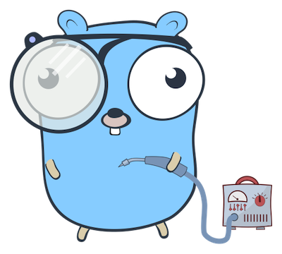
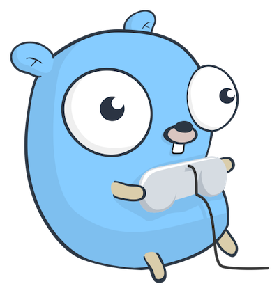

# 1: Welcome to the Machine



Welcome to your first day as Vice-President of Virtual Processors! You will find a key to the executive washroom on your desk, and free candy and snacks are available in the cafeteria. Please note there is no smoking anywhere in the building.

Your first job is to begin the design of a new virtual CPU, called the _G-machine_. Don't worry, we'll be tackling this project in easy stages. Let's first set out what exactly is required.

You will be developing a Go package which implements the G-machine. Users should be able to import your package and use it to write programs which run on the G-machine. We will develop a minimum viable product first, and gradually add more features as we go.

We will be using a simplified model of a computer system in which there are two main components:

* A **CPU** (Central Processing Unit) which executes instructions in sequence and has **registers** which hold data while it's being processed.
* A **memory** where we can store data and programs.

At any given moment, the G-machine has a certain **state**: the contents of the CPU's registers, and the contents of its memory.

A computer has to deal with data in fixed-size chunks, and the usual chunk size is called a **byte**. So each register stores one byte of data, and the memory is a sequence of bytes, each with its own unique *address* (which is two bytes long).

The first thing users need to be able to do is to create a new G-machine they can use. So there's a `gmachine.New()` function that returns a G-machine in its default initial state, which is specified by a test.

The test is in the file [`gmachine_test.go`](gmachine_test.go), and the `New` function is already implemented in the [`gmachine.go`](gmachine.go) file, so your first challenge is a straightforward one:

**TASK:** Run the test and make sure it passes.

# 2: Halt and Catch Fire


Hey, just FYI, we ran your draft G-machine design past the executive steering committee, and they loved it! Of course it's early days, but I'm sure this is going to be our next killer product. Let's start filling in some of the details.

## The fetch-execute cycle
The next feature we'll need in our virtual CPU is what's called the **fetch-execute cycle**. Essentially all computers work this way:

1. Fetch the next instruction from memory
2. Execute it.
3. Go to step 1.

## The program counter

Saying 'the **next** instruction' implies that we have some way of remembering where we currently 'are' in memory. That is to say, we need a CPU register that holds the memory address of the next instruction to execute. 

This is what the `pc` register is for (PC stands for 'Program Counter', which is the traditional name for this register). It keeps track of where the CPU is in the program.

## Instructions

You probably know that **machine language** is the name we give to the set of instructions which a given CPU can understand. For example, the x86_64 processor understands x86_64 machine language. This is the CPU's 'native' language, if you like. If you write a program in machine language, you can run it directly on the processor. Programs in other languages need to be translated (**compiled**) into the right machine language for the CPU you want to run them on.

## Opcodes

Each instruction is represented by a numeric code, called an **opcode**, where each number 0, 1, 2... represents a distinct instruction. A program for the G-machine consists of a sequence of opcodes, perhaps with some accompanying data.

We can imagine a variety of useful instructions which the G-machine might implement: for example, if we want to do arithmetic, we might need something like an `add` instruction.

## The `halt` instruction

For now, let's keep it simple, and implement a single instruction named `halt`, which does nothing except stop the machine. It's entirely up to us which numeric values to assign to opcodes, and it makes no difference to the machine as long as each opcode uniquely identifies an instruction. For simplicity, let's assign `halt` the opcode 0. You don't need to write any code for this for now, just remember that opcode 0 represents `halt`.

## The `Step()` method

Now that we have an instruction, we have something for the machine to do: execute it!

We'll need a way for users to tell the machine to do one iteration of its fetch-execute cycle: fetch the next instruction from memory at the address held by `pc`, execute it, and return. So there's a method on the `Machine` object named `Step()` that will do this.

What would happen if we were to call the `Step()` method on a newly-initialised machine, given that its memory and registers contain all zeroes? Well, let's follow the fetch-execute cycle:

1. Fetch the next instruction from memory. That is to say, look at the `pc` register to see what memory address it contains, and read the instruction at that address.
2. Since the `pc` register contains zero, we read the byte at address zero, which is zero.
3. We increment the `pc` register so that it points to the next memory address to read from (in this case, 1).
4. Execute the current instruction, whose opcode is 0. We know this is the opcode for the `halt` instruction, so there's nothing to do; we just need to return.

So the upshot of all this is that if you call `Step()` on a new machine, the state of the machine should be unchanged after it returns except that the `pc` register now contains the value 1.

Let's find out!

**TASK:** Uncomment the test function `TestHalt`, which does the following:

1. Creates a new G-machine.
2. Calls `Step()` on the machine.
3. Tests that the machine's `pc` register contains the value 1. If not, the test should fail with a message like `"want pc == 1, got ..."`

This test will not pass yet, because the `Step()` method currently does nothing. Over to you to fix that!

**TASK:** Write the code in `Step` needed to make this test pass.

When the test is passing, go on to the next section.

# 3: Busy Doing Nothing



Great job on implementing the `halt` instruction! We now have a _programmable_ computer system, even though the programs we can write are rather simple. This is the minimal valid G-machine program:

```asm
halt
```

In fact, that's also the _maximal_ program right now, since while we can write longer programs by repeating the `halt` instruction, the extra instructions have no effect.

We ran your prototype by the Marketing group, and the feedback was generally positive, but they asked if you couldn't add at least one more instruction, so that we can write and sell useful software for the machine.

## The `nop` instruction

The next instruction to implement will be `nop` (short for “No OPeration”), which does nothing. This might sound a bit similar to the `halt` instruction, which does nothing and halts, but there _is_ a difference: the `nop` instruction doesn't halt! Let's assign it opcode 1.

So let's do another thought experiment. What happens if we write the opcode for the `nop` instruction into memory address zero, and `Step()` the machine twice? (Think about it before you read on.)

Well, we know `pc` starts at zero, so the first thing the machine will do is read the instruction at address zero, which is `nop`. Since this has no effect, the `Step()` method will just return. When we call it again, the machine will fetch the instruction at address 1, which is `halt`. And `pc` should end up containing the value 2.

To put it another, equivalent, way, we're submitting the following program to the machine:

```asm
nop
halt
```

Let's make it work!

**TASK:** Write a test function `TestNop` (you can copy and adapt `TestHalt` if you like) along these lines:

1. Creates a new G-machine.
2. Sets the contents of the first memory location to 1 (the opcode for `nop`).
3. Calls `Step()` on the machine.
4. Tests that `pc` is 1.
5. Calls `Step()` again.
6. Tests that `pc` is now 2.

Remember, opcode 0 is `halt`, and opcode 1 is `nop`.

## Keep on runnin'

Of course, there's really no difference between `halt` and `nop` if we're just calling `Step`: the result is the same either way. The `halt` instruction only has a real effect if the machine is _running_, and we don't have that yet.

So suppose we had a method called `Run`, whose job is to step the machine continuously _until_ it gets a `halt` instruction. What would a test for `Run` look like? You might like to think about this a bit and see if you can come up with something. Your test should be able to distinguish between calling `Run` on the following two programs:

```asm
halt
```

and:

```asm
nop
halt
```

Essentially, the only difference is the expected value of `pc` afterwards, isn't it? In the first case, it would be 1, and in the second case, 2. Try writing a test along these lines. Now see if you can write a `Run` method that passes the test!

## Opcode constants

Now we can both `Run` and `Step` the machine, it's time to do a little refactoring. We're going to be using these opcodes a lot, so it'll be helpful to define some constants with informative names.

**TASK:** Define a new integer constant `NOP` with the value 1. You'll find there's already a constant `HALT` with the value 0, so you can put `NOP` next to it.

Refactor the tests and the `gmachine` package to use these constants (for example, in `TestNop`, we should set the contents of address zero to the named constant `NOP`, instead of a literal `1`.)

Use the tests to make sure that your refactoring didn't break anything. Check that you also used the constants in your `switch` statement. If you like, change the values of the two constants to something different (99 and 100, say) and make sure that everything still passes (it should).

When you're happy with the code, move on to the next section.

# 4: Ascending and Descending


You're doing great! Thanks to you, we have a working virtual processor, and the foundations of an excellent Go library—with tests!

It's time to start adding some more functionality to the G-machine. To truly be a _computer_, we need it to be able to _compute_, that is, to calculate. Let's start by adding a new register for this purpose: the `a` register.

## The `a` register

If you think about it, when we're doing some kind of arithmetic, like adding up a list of numbers, we have some concept of 'the current result'. On an electronic calculator, there's a display that shows the number 0 when you turn it on. If you press the `+` key, enter the value `1`, and press the `=` key, the display will show the value `1` (if your calculator is working correctly).

That's the 'current result', and you can keep on adding, subtracting, multiplying, and so on, and at the end of the calculation that result will be the answer. We can imagine a CPU register that plays a similar role; think of it as a kind of scratchpad where you can store intermediate results during a calculation. The technical name is the **accumulator**, but let's call our register `a` for short.

**TASK:** Modify `TestNew` to expect the G-machine to have a register named `a`, just like the existing `pc` register, and verify that its initial value is zero. Implement this so that the test passes.

## Increment and decrement instructions

We'll need to be able to modify the contents of this register, and the simplest way to do that is to **increment** (add one to) or **decrement** (subtract one from) it. Let's add some new instructions to do that:

* `inc a` (opcode 48)
* `dec a` (opcode 64)

**TASK:** Add a new test `TestIncA`. The test should do the following:

1. Create a new G-machine.
2. Set the first memory location to the value corresponding to the opcode for `inc a`.
3. `Run` the machine. It should halt after the first instruction, because the memory otherwise contains all zeroes, which is the opcode for `halt`.
4. Verify that the `a` register's value is now 1 (don't worry about testing `pc` too; we already know that works).

Remember, we need to see the test fail the right way before we start implementing the code necessary to make it pass. Assuming the test is correct, what will be the result of running it without that implementation? Figure this out for yourself before actually running the test. If the test produces the result you expect, we can have some confidence that it's correct.

**TASK:** Implement the `inc a` instruction so that your test passes.

**TASK:** Add a corresponding test for the `dec a` instruction, that first of all sets the `a` register to the value 2, then executes a `dec a` instruction, and verifies that the result is 1. Implement the `dec a` instruction so that the test passes.

## Doing calculations

We now have a machine with basic arithmetic facilities! They might seem rather limited, but there's a lot we can do even with only increment and decrement instructions.

For example, we can set the `a` register to any value we want, just by executing a long enough sequence of `inc a` instructions. We've already set the `a` register to the value 1 in our test, by incrementing it one time from its initial value of zero.

Consider this program in the little language we've designed for the G-machine:

```asm
inc a
inc a
inc a
halt
```

By the way, a symbolic language like this where each line corresponds to a machine-code instruction is called an **assembly language**. Each CPU has its own assembly language, and this is the G-machine's.

So what does this program do? Assuming we run it on a freshly-initialized machine, what will be the value of `a` afterwards? Easy, right? It should be 3.

It would be inconvenient to do very complicated arithmetic this way, but the machine is perfectly capable of it in principle. Later, we'll add facilities to make this easier, but let's wrap up this section with a cool demonstration to show the team what you've been up to.

**TASK:** Write a program in the G-machine assembly language which calculates the result of subtracting 2 from 3. You don't need any new instructions; just use the ones you already have in the right way to get the effect of setting `a` to 3, and then decrementing it twice. Write a test which executes this program and checks the result.

# 5: Think of a Number


Congratulations on a successful demo! Even though the G-machine's architecture is extremely simple, and right now it only has a few instructions, it's capable of solving a wide range of arithmetic problems.

Let's expand that capability now by adding a powerful new feature: **operands**.

## Operands

Right now we can set the `a` register to any value we want by executing the `inc a` instruction enough times. But, if you think about it, this means that in order to change the 'input value', we need to rewrite the program. That's a little inconvenient; we would like to be able to ship programs to customers which can operate on _arbitrary_ data.

For example, consider your 'subtract 2' program. It can only operate on the value 3, and in order to subtract 2 from anything else, we have to alter the program. How can we write a 'subtract 2 from any number' program? Or, for that matter, a 'subtract any number from any number' program?

To do that, we need some concept of **data**. That is to say, treating a number stored in memory not as an opcode signifying a machine instruction, but merely as a number. In order to do something useful with a value in memory like this, the first thing we'll want to do is **load** it into a register (`a`, for example).

The G-machine has an instruction for that, called `ld a` (opcode 16). For example:

```asm
ld a, 5
```

Here, `ld a` is a **mnemonic** (that's what we call the human-readable symbolic name for a machine instruction) meaning “load `a` with...” whatever value follows.

The effect of this instruction would be to set the `a` register to the value 5 (and we could of course substitute any other value we choose). How would this work?

We know how to define new instructions; we've done that a few times already. Adding the new opcode for `ld a` is no problem. But there's something new here: this opcode requires an operand: a value to operate on. This value will, naturally, be stored in memory.

How could we incorporate this idea into our existing G-machine architecture? Think about it a little before you read on.

## Implementing operands

One way we could do this is to have the `ld a` instruction trigger a memory fetch, just like we fetch the next instruction as part of the fetch-execute cycle. 

So as part of the implementation for the `ld a` opcode, we could read the contents of memory pointed to by the `pc` register, and put that value into the `a` register. (We'll need to increment `pc` after this, too, or we won't be able to fetch the next instruction correctly.)

For example, if the program were `ld a, 5`, the memory might contain the byte values 16 (opcode for `ld a`) and 5 (operand value 5).

**TASK:** Write a test for the `ld a` instruction, and make it pass. It should not only verify the contents of the `a` register, but also that the `pc` register is correctly updated following the data fetch.

## Programs on arbitrary data

Excellent! This is an important new capability for the G-machine: we can now write programs that operate on arbitrary stored data. In fact, we can rewrite the 'subtract 2 from 3' program using this feature.

**TASK:** Rewrite your test for the 'subtract 2 from 3' program so that it executes and verifies the following assembly language program instead:

```asm
ld a, 3
dec a
dec a
```

Although this looks very similar to the previous implementation, there's an important difference. The starting value of `a` is controlled not by the program instructions, but by the contents of memory location 1 (that is, the second memory location).

This means we can provide different 'inputs' to this program by writing to that memory location.

**TASK:** Expand your test for the 'subtract 2' program to test three different starting values of `a`, by writing them to the appropriate memory location and rerunning the machine. You will need to reset the `pc` register to zero each time you update the input value, before you call `Run()`.

## Running programs

Nice work! We have some enterprise customers with a pressing need to subtract 2 from a large set of arbitrary numbers, and this feature will really help our market penetration there.

You've earned a little refactoring, so let's add a facility which will make it easier to write new tests (and, indeed, programs in general). Instead of having to store our test programs and data into the G-machine's memory and then call `Run()`, let's provide a convenience method which takes a program and runs it for us.

**TASK:** Add a method on the G-machine called `RunProgram()` which takes a slice of bytes representing a program, stores it into the machine's memory, and executes it.

For example, if we wanted to rewrite our original `TestNop` test to use `RunProgram()`, we might write it something like this:

```go
g := gmachine.New()
g.RunProgram([]byte{
    gmachine.NOP,
    gmachine.HALT,
})
if g.CPU.PC != 2 {
    t.Errorf("want pc == 2, got %d", g.CPU.PC)
}
```

Rewrite `TestNop()` to use `RunProgram()`, and make sure it still passes.

**TASK:** Refactor all the existing tests to use `RunProgram()`.

## Next steps

Congratulations, you've designed and built your own computer system! Now it's up to you what you choose to add to it.

Some ideas:

* Write an *assembler* program that can read source files in the G-machine assembly language and translate them into a binary format that the G-machine can run. For example, it could accept a program like this:

  ```asm
  inc a
  halt
  ```
  
  and produce the corresponding sequence of opcodes as a `[]byte`. You could execute this directly using `RunProgram`, or you could write the byte data to a binary file on disk (a G-machine **executable**).
  
* Write an **emulator** program that reads these executable binary files and executes them.

* Extend your emulator so that it can optionally run the G-machine program one instruction at a time, showing the state of the CPU registers and memory after each instruction. This is called a **monitor** (because it lets you monitor what's going on) or a **debugger** (because that's very helpful when your program has a bug!)

* Write a **disassembler**. You can probably guess what this does: it's the inverse of an assembler. It takes binary executables as input, and produces G-machine assembly language source code as output. If you assemble a given program and then disassemble the result, you should get back what you started with.

## Going further

The G-machine's instruction set is very small, to keep things nice and simple and to make it easy to write a working emulator and assembler. If you want to continue the fun, you could adapt and extend your program to emulate a more complicated, and realistic CPU:

* The [**R8**](https://github.com/bitfield/rx82#r8-technical-manual) is a simple 8-bit CPU whose instruction set is very similar to the G-machine's (not by coincidence; I designed it to be the ideal next step after this project). It works exactly the same way; it just has more registers, more instructions, and some neat features that the G-machine doesn't have.

  Start with this one, because your G-machine emulator already implements a subset of the R8's instruction set.

* The [6502](https://6502.org/) is a historical 8-bit CPU from the mid-1970s which was incredibly popular and widely used, in home computers such as the Apple II, BBC Micro, and Commodore 64. It's pretty similar to an R8, just with some interesting differences and a personality of its own.

  Emulating the 6502 is a choose-your-own-difficulty adventure, from fairly easy to quite complicated, depending how accurate and sophisticated you want your emulator to be.

* The [Z80](http://www.z80.info/) is another historical 8-bit CPU that's possibly even more ubiquitous than the 6502, used in the ZX Spectrum, MSX, Game Boy, and many other machines.

  Emulating it is more of a challenge than the 6502, since it has a large and fairly complex instruction set, but then it's a more powerful and interesting machine.

## Going MORE further

Modern CPUs aren't really that different to these early designs, just a lot faster, and they have many extra features and optimisations that emulator writers have to take account of. Once you fully understand a simple machine like the R8 or 6502 (and writing an emulator is the perfect way to do this), you're in a much better position to start learning about modern architectures like x86 or ARM—and maybe even emulating them.

Have fun!

<small>Gopher images by [egonelbre](https://github.com/egonelbre/gophers)</small>
